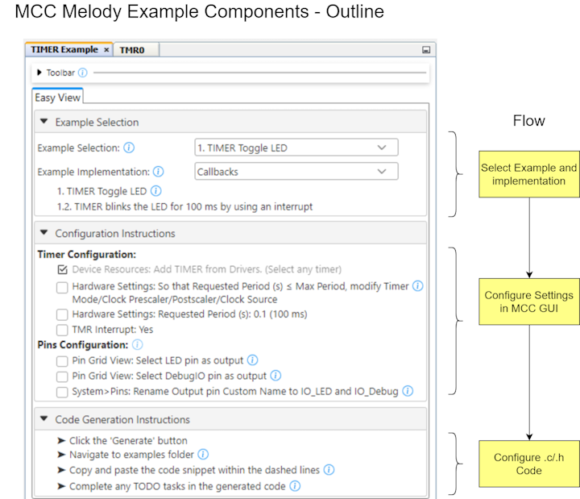

<!-- Please do not change this logo with link -->

<a target="_blank" href="https://www.microchip.com/" id="top-of-page">
   <picture>
      <source media="(prefers-color-scheme: light)" srcset="images/mchp_logo_light.png" width="350">
      <source media="(prefers-color-scheme: dark)" srcset="images/mchp_logo_dark.png" width="350">
      
   </picture>
</a>

# MCC Melody Timer Toggle LED Example, Polled Implementation (PIC18F57Q43)

The [TIMER Toggle LED example](https://onlinedocs.microchip.com/v2/keyword-lookup?keyword=MCC.MELODY.EXAMPLES.RUNNING.TIMER.PIC16F18F.TOGGLE.LED&version=latest&redirect=true
), of the MCC Melody Timer Example Component, is used in the **Polled Implementation**.  The LED on the PIC18F57Q43 Curiosity Nano is toggled, as well as a Debug I/O, which can be used to verify the 100 ms period. 

<!-- This is where the introduction to the example goes, including mentioning the peripherals used -->

## MCC Melody Example Components
Example Components are a tight integration of learning material directly into MCC. This allows users to conveniently place configuration instructions side-by-side to the components they are configuring. For more information, refer to the [MCC Melody Example Components Introduction](https://onlinedocs.microchip.com/v2/keyword-lookup?keyword=MCC.MELODY.EXAMPLES&version=latest&redirect=true). 

Complete projects, available in [MPLAB® Discover](https://mplab-discover.microchip.com) or GitHub, are specific to a board and microcontroller. However, the current project could be recreated on a range of supported microcontrollers by following the steps in the example component.

To explore what an example component is, as well as the difference between example and implementation, see [MCC Melody Example Components - The Basics](https://onlinedocs.microchip.com/v2/keyword-lookup?keyword=MCC.MELODY.EXAMPLES.BASICS&version=latest&redirect=true).

Example Components are related to [MCC Melody Design Patterns for Control Flow](https://onlinedocs.microchip.com/g/GUID-7CE1AEE9-2487-4E7B-B26B-93A577BA154E), which shows different standard ways to organize `main.c` and other application-level files, such as Polling, Interrupt and Callback, or State Machine Design Patterns. You may be familiar with each of these patterns, but...
- What support does MCC Melody provide for each?
- What are the recommended ways of building on the MCC Melody generated code? 

## Software Used

- MPLAB® X IDE 6.20.0 or newer [(MPLAB® X IDE 6.20)](https://www.microchip.com/en-us/development-tools-tools-and-software/mplab-x-ide)
- MPLAB® XC8 2.46.0 or newer [(MPLAB® XC8 2.46)](https://www.microchip.com/en-us/tools-resources/develop/mplab-xc-compilers/xc8)

## Hardware Used

- PIC18F57Q43 Curiosity Nano [(DM164150)](https://www.microchip.com/en-us/development-tool/DM164150)
- Curiosity Nano Explorer [(EV58G97A)](https://www.microchip.com/en-us/development-tool/EV58G97A)

<!-- All hardware used in this example must be listed here. Use unbreakable links!
     - PIC18F47Q10 Curiosity Nano [(DM182029)](https://www.microchip.com/Developmenttools/ProductDetails/DM182029)
     - Curiosity Nano Base for Click boards™ [(AC164162)](https://www.microchip.com/Developmenttools/ProductDetails/AC164162)
     - POT Click board™ [(MIKROE-3402)](https://www.mikroe.com/pot-click) -->

## Setup

All instructions required to recreate this example are listed below, under Configuration Instructions.   

Once you have loaded the project in MPLAB X IDE, you will also be able to find more information from Tooltips and links next to the instructions 
 .

<!-- Explain how to connect hardware and set up software. Depending on complexity, step-by-step instructions and/or tables and/or images can be used -->

## Operation

The image below shows the [TIMER Toggle LED example](https://onlinedocs.microchip.com/v2/keyword-lookup?keyword=MCC.MELODY.EXAMPLES.RUNNING.TIMER.PIC16F18F.TOGGLE.LED&version=latest&redirect=true
) running. The period of 100 ms is verified using Debug GPIO on the MPLAB Data Visualizer. A PIC18F57Q43 Curiosity Nano is used.

**Note:** Achieve the same functionality by adding the Timer Example Component to a new or existing MCC Melody project, for one of the supported microcontrollers.  

Two vertical cursors are added to verify the timer frequency. See the configuration instructions below.
 

A logic analyzer can be used instead of Debug GPIO on the MPLAB Data Visualizer.

<!-- Explain how to operate the example. Depending on complexity, step-by-step instructions and/or tables and/or images can be used -->

## Summary

<!-- Summarize what the example has shown -->
For more example components, open the stand-alone Content Mangager  in MCC. 

 

