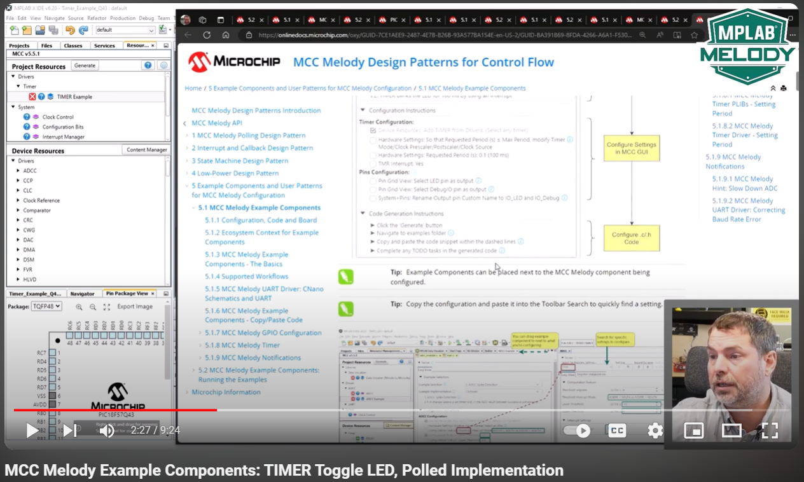
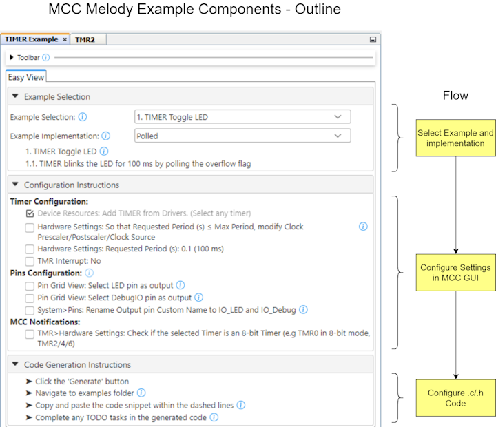
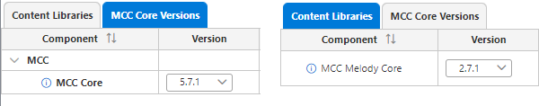
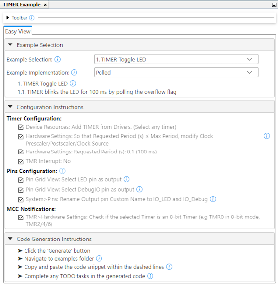
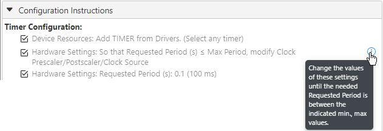
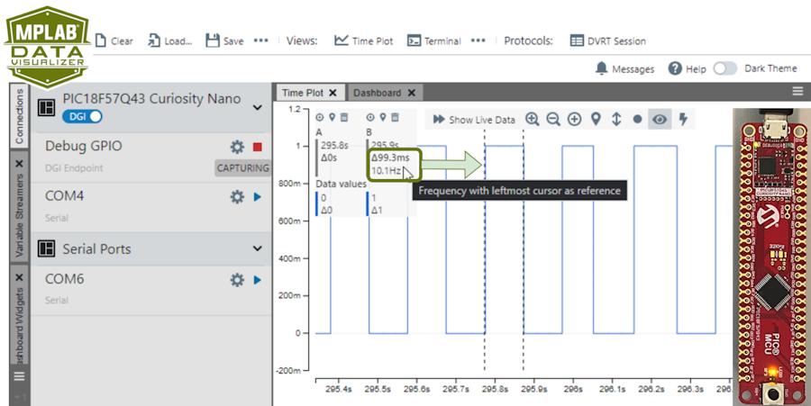
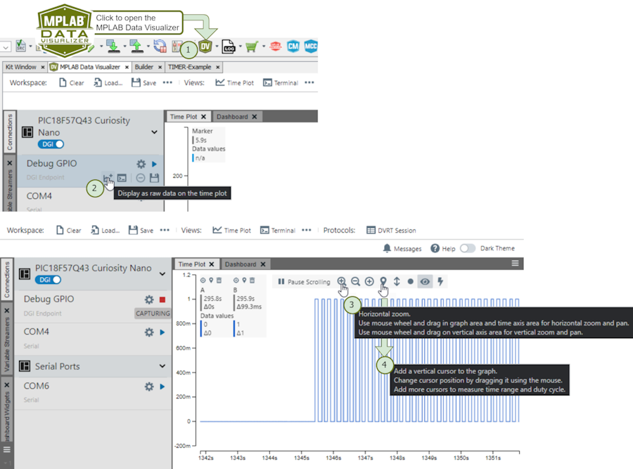
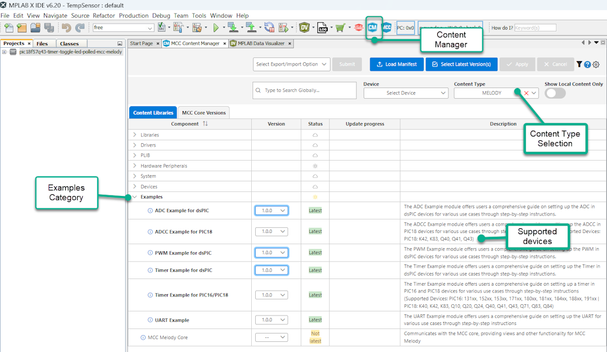

# MCC Melody Timer Toggle LED Example - Polled Implementation (PIC18F57Q43)

The [TIMER Toggle LED example](https://onlinedocs.microchip.com/v2/keyword-lookup?keyword=MCC.MELODY.EXAMPLES.RUNNING.TIMER.PIC16F18F.TOGGLE.LED&version=latest&redirect=true
), of the MCC Melody Timer Example Component, is used in the Polled Implementation.  The LED on the PIC18F57Q43 Curiosity Nano is toggled, as well as a Debug I/O, which can be used to verify the 100 ms period. 

## Video Building This Example & Introducing MCC Melody Example Components 

## MCC Melody Example Components
Example Components are a tight integration of learning material directly into MCC. This allows users to conveniently place configuration instructions side-by-side to the components they are configuring. For more information, refer to the [MCC Melody Example Components Introduction](https://onlinedocs.microchip.com/v2/keyword-lookup?keyword=MCC.MELODY.EXAMPLES&version=latest&redirect=true). 

Complete projects, available in [MPLAB® Discover](https://mplab-discover.microchip.com) or GitHub, are specific to a board and microcontroller. However, the current project could be recreated on a range of supported microcontrollers by following the steps in the example component.

To explore what an example component is, as well as the difference between example and implementation, see [MCC Melody Example Components - The Basics](https://onlinedocs.microchip.com/v2/keyword-lookup?keyword=MCC.MELODY.EXAMPLES.BASICS&version=latest&redirect=true).

Example Components are related to [MCC Melody Design Patterns for Control Flow](https://onlinedocs.microchip.com/g/GUID-7CE1AEE9-2487-4E7B-B26B-93A577BA154E), which shows different standard ways to organize `main.c` and other application-level files, such as Polling, Interrupt and Callback, or State Machine Design Patterns. Users might be familiar with each of these patterns, but...
- What support does MCC Melody provide for each?
- What are the recommended ways of building on the MCC Melody generated code? 

## Software Used
- MPLAB® X IDE 6.20.0 or newer [(MPLAB® X IDE 6.20)](https://www.microchip.com/en-us/development-tools-tools-and-software/mplab-x-ide)
- MPLAB® XC8 2.46.0 or newer [(MPLAB® XC8 2.46)](https://www.microchip.com/en-us/tools-resources/develop/mplab-xc-compilers/xc8)

- MCC Plugin Version 5.5.1 or newer (Tools>Plugins>Installed, search: "MCC")
- Timer Example Component 1.0.0 or newer
- MCC Core 5.7.1 or newer 
- MCC Melody Core 2.7.1 or newer (Communicates with the MCC core, providing views and other functionalities for MCC Melody)

  

## Hardware Used
- PIC18F57Q43 Curiosity Nano [(DM164150)](https://www.microchip.com/en-us/development-tool/DM164150)
- Curiosity Nano Explorer [(EV58G97A)](https://www.microchip.com/en-us/development-tool/EV58G97A) - Not used in this example, but used further in the series. 

## Setup
All instructions required to recreate this example are listed below, under Configuration Instructions.   

Once you have loaded the project in MPLAB X IDE, you will also be able to find more information from Tooltips and links next to the instructions 
 .

## Operation
The image below shows the [TIMER Toggle LED example](https://onlinedocs.microchip.com/v2/keyword-lookup?keyword=MCC.MELODY.EXAMPLES.RUNNING.TIMER.PIC16F18F.TOGGLE.LED&version=latest&redirect=true
) running. The period of 100 ms is verified using Debug GPIO on the MPLAB Data Visualizer. A PIC18F57Q43 Curiosity Nano is used.

**Note:** Achieve the same functionality by adding the Timer Example Component to a new or existing MCC Melody project, for one of the supported microcontrollers.  

Two vertical cursors are added to verify the timer frequency. See the configuration instructions below.

1) Click the  icon to open the MPLAB Data Visualizer.
2) Under Debug GPIO click the  icon, to add to the time plot.
3) Click the  icon a few times to zoom in on the Time Plot.
4) Click the  icon a couple of times to add two vertical cursors. Change the cursor positions by dragging them using the mouse, to measure the timer period. 

 

A logic analyzer can be used instead of Debug GPIO on the MPLAB Data Visualizer.

## Summary
For more example components, open the stand-alone Content Manager  in MCC. 

 

